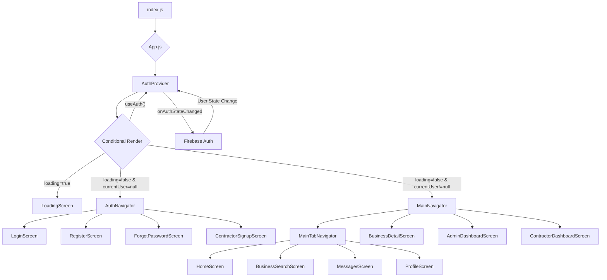

# Authentication and Navigation Flow Analysis & Proposed Solution

## 1. Authentication Flow Analysis

The application's authentication process integrates both Firebase for initial user authentication and a custom backend for user management and JWT issuance. The `LoginScreen.js` component orchestrates this complex flow.

### Flow Description:

1.  **User Input (`src/screens/LoginScreen.js`):**
    *   Users provide their email and password in the `LoginScreen.js` interface.
    *   The `handleLogin` function is invoked upon submission.

2.  **Firebase Authentication (`src/screens/LoginScreen.js` & `src/firebaseConfig.js`):**
    *   The `signInWithEmailAndPassword(auth, email, password)` function is called to authenticate the user against Firebase.
    *   A `userCredential` object, containing the Firebase `user` object, is returned upon successful authentication.
    *   Immediately after, `await user.reload()` is executed to fetch the most current `emailVerified` status from Firebase.
    *   **Critical Check:** If `reloadedUser.emailVerified` is `false`, the application explicitly prevents navigation to the 'Main' view and displays a message prompting email verification.

3.  **Firebase ID Token Generation (`src/screens/LoginScreen.js`):**
    *   If the Firebase email is confirmed as verified, `reloadedUser.getIdToken()` is called. This generates a Firebase ID Token, a JSON Web Token (JWT) signed by Firebase, which serves as proof of the user's Firebase authentication.

4.  **Backend Login (`src/screens/LoginScreen.js` -> `src/api/auth.js` -> `src/utils/apiClient.js` -> `backend/controllers/userController.js`):**
    *   The Firebase ID Token and the user's email are sent to the custom backend via the `backendLoginFirebase(idToken, email)` function in `src/api/auth.js`.
    *   `src/api/auth.js` utilizes the `post` function from `src/utils/apiClient.js` to send an HTTP POST request to the `/api/users/login` endpoint. The Firebase ID Token is included in the `Authorization` header as a Bearer token.
    *   On the backend, the `loginUser` function within `backend/controllers/userController.js` processes this request.
        *   It attempts to locate a user by their `firebaseUid` (if provided) or `email`.
        *   It verifies the user's existence and checks their `isVerified` status in the backend database. **If `!user.isVerified`, a 403 Forbidden error is returned.**
        *   If the user is found and their email is verified in the backend, a custom backend JWT is generated using `generateToken(user._id)` (from `backend/utils/authUtils.js`) and included in the response.

5.  **Backend JWT Storage (`src/api/auth.js`):**
    *   Upon successful `backendLoginFirebase` call and receipt of a backend `token`, this JWT is stored locally in `AsyncStorage` using `AsyncStorage.setItem('userToken', data.token)`.

6.  **Email Verification Status Synchronization (`src/screens/LoginScreen.js` -> `src/api/auth.js` -> `backend/controllers/userController.js`):**
    *   Following a successful backend login, `syncEmailVerificationStatus(idToken, email, true)` is invoked. This action updates the user's `isVerified` status in the backend database to `true`, ensuring data consistency between Firebase and the custom backend.
    *   The `updateEmailVerificationStatus` function in `backend/controllers/userController.js` handles this update.

7.  **Navigation to Main (`src/screens/LoginScreen.js`):**
    *   Navigation to the 'Main' application view (`navigation.navigate('Main')`) only proceeds after both Firebase authentication (including the email verification check) and successful backend login (with backend JWT acquisition) are completed.

### Authentication Flow Diagram:

```mermaid
sequenceDiagram
    participant User as User
    participant LS as LoginScreen.js
    participant FA as Firebase Auth
    participant AA as src/api/auth.js
    participant AC as src/utils/apiClient.js
    participant BC as backend/controllers/userController.js
    participant DB as Backend DB
    participant AS as AsyncStorage

    User->>LS: Enter Email/Password
    LS->>FA: signInWithEmailAndPassword(email, password)
    FA-->>LS: UserCredential (user object)
    LS->>FA: user.reload()
    FA-->>LS: Reloaded User (with emailVerified status)
    alt Email Not Verified
        LS->>LS: Show Verification Message
        LS->>LS: Prevent Navigation to Main
    else Email Verified
        LS->>FA: reloadedUser.getIdToken()
        FA-->>LS: Firebase ID Token
        LS->>AA: backendLoginFirebase(idToken, email)
        AA->>AC: post(/api/users/login, {email, firebaseUid}, {Authorization: Bearer idToken})
        AC->>BC: POST /api/users/login
        BC->>DB: Find User by firebaseUid/email
        DB-->>BC: User Data (including isVerified)
        alt Backend Email Not Verified
            BC-->>AC: 403 Forbidden (Email not verified)
            AC-->>AA: Error
            AA-->>LS: Error
            LS->>LS: Show Login Failed Toast
        else Backend Email Verified
            BC->>BC: Generate Backend JWT
            BC-->>AC: Backend JWT + User Data
            AC-->>AA: Backend JWT + User Data
            AA->>AS: setItem('userToken', backendJWT)
            AS-->>AA: Token Stored
            AA-->>LS: Backend Login Success
            LS->>AA: syncEmailVerificationStatus(idToken, email, true)
            AA->>AC: post(/api/users/verify-email, {email, isVerified: true, firebaseUid}, {Authorization: Bearer idToken})
            AC->>BC: POST /api/users/verify-email
            BC->>DB: Update User.isVerified to true
            DB-->>BC: Update Success
            BC-->>AC: Success
            AC-->>AA: Success
            AA-->>LS: Sync Success
            LS->>LS: Show Login Success Toast
            LS->>LS: navigation.navigate('Main')
    end
```

## 2. Navigation Flow Analysis

The application's navigation is managed by `react-navigation`, with the root `App.js` component dynamically rendering the appropriate top-level navigator based on the user's authentication state.

### Flow Description:

1.  **Root Component (`index.js` -> `App.js`):**
    *   `index.js` registers the `App` component as the application's entry point.
    *   `App.js` wraps the `AppContent` component with an `AuthProvider`.
    *   A `useEffect` hook in `App.js` explicitly calls `signOut(auth)` on app launch. This action clears any existing Firebase authentication state, effectively forcing a fresh login upon every application start.

2.  **Authentication Context (`src/context/AuthContext.js`):**
    *   The `AuthProvider` component utilizes Firebase's `onAuthStateChanged` listener to monitor changes in the Firebase authentication state.
    *   When a user logs in via Firebase, `onAuthStateChanged` is triggered, and the Firebase `user` object is received.
    *   The `user` object is immediately reloaded (`await user.reload()`) to retrieve the most current `emailVerified` status.
    *   `setCurrentUser(firebaseAuth.currentUser)` updates the `currentUser` state within the context.
    *   The `loading` state is set to `false` once the initial authentication state has been determined.
    *   The `currentUser` and `loading` states are exposed to consuming components via the `useAuth` hook.

3.  **Conditional Navigation (`App.js` -> `AppContent`):**
    *   The `AppContent` component consumes the `currentUser` and `loading` states from the `useAuth()` hook.
    *   If `loading` is `true`, a `LoadingScreen` is rendered.
    *   Once `loading` is `false`:
        *   If `currentUser` is truthy (indicating a Firebase user is logged in), the `MainNavigator` is rendered.
        *   If `currentUser` is null (indicating no Firebase user is logged in), the `AuthNavigator` is rendered.

4.  **Navigators (`src/navigation/AuthNavigator.js` & `src/navigation/MainNavigator.js`):**
    *   **`AuthNavigator.js`**: This is a `StackNavigator` that encapsulates unauthenticated routes such as `LoginScreen`, `RegisterScreen`, `ForgotPasswordScreen`, and `ContractorSignupScreen`. It is displayed when `currentUser` is null.
    *   **`MainNavigator.js`**: This is a `StackNavigator` that contains the primary application routes. It embeds a `BottomTabNavigator` (`MainTabNavigator`) for core application screens (Home, Search, Messages, Profile) and also includes other screens like `BusinessDetailScreen`, `AdminDashboardScreen`, and `ContractorDashboardScreen`. This navigator is displayed when `currentUser` is not null.

### Navigation Flow Diagram:



## 3. Identified Redundancies or Misconfigurations

Based on the analysis, several areas present redundancies or misconfigurations that can lead to incorrect navigation or a suboptimal user experience:

1.  **`App.js` `signOut` on Launch:** The `useEffect` in `App.js` that calls `signOut(auth)` on app launch is a significant issue. While it ensures a "fresh" login experience, it actively prevents persistent Firebase sessions. This means if a user closes and reopens the app, they are immediately logged out, even if their Firebase session was still valid. This design choice negatively impacts user convenience and contradicts the typical behavior of authenticated applications. It also forces `AuthContext`'s `onAuthStateChanged` to initially observe a `null` user, regardless of a potentially existing Firebase session, until a new explicit login occurs.

2.  **Sole Reliance on `currentUser` from `AuthContext` for Top-Level Navigation:**
    *   The `App.js`'s `AppContent` component makes its primary navigation decision (between `AuthNavigator` and `MainNavigator`) based *solely* on the `currentUser` object provided by `AuthContext`.
    *   The `AuthContext`'s `currentUser` state is directly derived from the Firebase `onAuthStateChanged` listener.
    *   This creates a vulnerability: if Firebase reports a logged-in user (i.e., `currentUser` is not null), `MainNavigator` will be rendered, even if:
        *   The user's email is *not* verified (a check that `LoginScreen.js` performs, but not at the root level).
        *   The backend JWT is missing, expired, or invalid.
    *   While `LoginScreen.js` correctly prevents navigation to 'Main' if the Firebase email is not verified *during the login flow*, this check is not globally enforced at the root navigation level. If a user's Firebase session persists (which the current `App.js` prevents, but would be an issue if that were changed), and their email verification status changes *after* initial login, or if the backend JWT expires/becomes invalid, the app could still display `MainNavigator` based purely on the Firebase `currentUser` object.

3.  **Backend JWT Validation Not Integrated into Root Navigation Decision:**
    *   The presence and validity of the backend JWT (stored in `AsyncStorage`) are crucial for the application to successfully interact with protected backend resources via `apiClient.js`'s `getAuthHeaders`.
    *   However, the root navigation logic in `App.js` does *not* incorporate any check for the existence or validity of this backend JWT. It exclusively relies on the Firebase authentication state.
    *   Consequently, a user could appear "logged in" from a Firebase perspective (and thus be directed to `MainNavigator`), but be unable to perform any meaningful actions requiring backend interaction because their backend JWT is absent or invalid. This leads to a broken user experience where the UI suggests access that the backend denies.

4.  **Email Verification Check Duplication and Potential Inconsistency:**
    *   `LoginScreen.js` explicitly checks `reloadedUser.emailVerified` and blocks navigation if false.
    *   `backend/controllers/userController.js`'s `loginUser` also verifies `user.isVerified` in the database and returns a 403 error if it's false.
    *   While `syncEmailVerificationStatus` aims to keep these two states synchronized, the root navigation's reliance solely on Firebase's `currentUser` (which might not immediately reflect the `emailVerified` status accurately without a reload, or might not be sufficient if the backend state is the ultimate source of truth) can lead to inconsistencies. The application needs a single, authoritative source for the "logged in and fully authorized" state.

## 4. Propose a High-Level Solution

The fundamental problem is that the top-level navigation decision is made based on an incomplete picture of the user's authentication status, specifically lacking robust checks for backend authentication and comprehensive Firebase email verification at the root.

**Proposed Architectural Solution:**

1.  **Centralize Comprehensive Authentication State in `AuthContext`:**
    *   The `AuthContext.js` should be refactored to manage a more holistic `authState` object. This object will consolidate all necessary authentication-related information:
        *   `firebaseUser`: The Firebase user object (or `null`).
        *   `backendToken`: The backend-issued JWT (or `null`). This should be read from `AsyncStorage` when the app loads and updated upon successful backend login.
        *   `isEmailVerified`: A boolean flag indicating the Firebase email verification status. This should be derived from `firebaseUser.emailVerified` after a `user.reload()`.
        *   `isAuthenticated`: A derived boolean that is `true` *only if* all the following conditions are met:
            *   `firebaseUser` exists (Firebase authenticated).
            *   `isEmailVerified` is `true` (Firebase email verified).
            *   `backendToken` is present and, ideally, validated (backend authenticated).
        *   `isLoading`: The current loading state of the authentication process.
    *   The `onAuthStateChanged` listener in `AuthContext` should be enhanced to:
        *   Set the `firebaseUser` state.
        *   Immediately perform `await user.reload()` to get the latest `emailVerified` status.
        *   Attempt to retrieve the `userToken` (backend JWT) from `AsyncStorage`.
        *   Based on these pieces of information, update the `isEmailVerified` and `isAuthenticated` flags.
        *   Consider adding a lightweight mechanism to validate the backend token's expiry (e.g., by decoding the JWT client-side if it's not sensitive, or making a quick API call to a protected endpoint) within `AuthContext` or a dedicated helper function. If the backend token is invalid or expired, `isAuthenticated` should be `false`.

2.  **Modify `App.js` for Robust Root Navigation:**
    *   **Remove the `signOut(auth)` call on app launch in `App.js`'s `useEffect`.** This will allow Firebase sessions to persist across app restarts, improving user experience.
    *   The `AppContent` component should then exclusively use the `isAuthenticated` flag from the enhanced `AuthContext` to conditionally render either `MainNavigator` or `AuthNavigator`. This ensures that the user is only directed to the main application if all authentication criteria (Firebase, email verification, backend JWT) are met.

3.  **Refine Login Flow in `LoginScreen.js`:**
    *   The existing checks within `LoginScreen.js` for Firebase email verification and successful backend token acquisition are appropriate and should be retained.
    *   After a successful backend login and the backend token is stored in `AsyncStorage`, `LoginScreen.js` should trigger an update to the `AuthContext`'s state (e.g., by calling a dedicated function provided by the context, or by simply relying on `onAuthStateChanged` and `AsyncStorage` changes) to reflect the new `backendToken` and subsequently update the `isAuthenticated` status. This will then cause `App.js` to re-render `MainNavigator`.

4.  **Implement a Token Refresh/Validation Mechanism (Optional but Recommended for Production):**
    *   Within `src/utils/apiClient.js` (or potentially within `AuthContext.js` for a more centralized approach), implement logic to proactively check the validity of the backend JWT before making authenticated API calls.
    *   If the token is found to be expired or invalid, the application should attempt to refresh it (if the backend provides a refresh token mechanism) or, failing that, gracefully force a re-authentication (e.g., by clearing all authentication states and navigating to the login screen). This prevents users from being in a visually "logged-in" state but encountering repeated API errors due to an invalid backend token.

### High-Level Solution Diagram:

```mermaid
graph TD
    subgraph Frontend
        A[index.js] --> B[App.js]
        B --> C[AuthProvider (AuthContext)]
        C -- Provides {firebaseUser, backendToken, isEmailVerified, isAuthenticated, isLoading} --> D[AppContent]
        D{Is Authenticated?} -- Yes --> E[MainNavigator]
        D -- No --> F[AuthNavigator]
        F --> G[LoginScreen.js]
        G -- Login Action --> H[src/api/auth.js]
        H -- Backend Login & Token Storage --> C
        C -- onAuthStateChanged & Token Check --> C
    end

    subgraph Backend
        I[backend/controllers/userController.js]
        J[Backend DB]
        H --> I
        I --> J
    end

    subgraph Key State Management
        C -- Manages --> K[Firebase User State]
        C -- Manages --> L[Backend JWT in AsyncStorage]
        C -- Derives --> M[isEmailVerified]
        C -- Derives --> N[isAuthenticated (K && M && L)]
    end

    style D fill:#f9f,stroke:#333,stroke-width:2px
    style N fill:#ccf,stroke:#333,stroke-width:2px
```

## Summary of Proposed Changes:

*   **`App.js`**: Remove the `signOut` call on app launch. The top-level navigation decision will now be driven by the comprehensive `isAuthenticated` state from `AuthContext`.
*   **`AuthContext.js`**: Expand the authentication state to explicitly track `backendToken` and `isEmailVerified`. Crucially, the `isAuthenticated` flag will be a derived state, becoming `true` only when a Firebase user is present, their email is verified, and a valid backend JWT exists. Logic to read the `userToken` from `AsyncStorage` on initial load and `onAuthStateChanged` will be added.
*   **`LoginScreen.js`**: The existing Firebase and backend login logic will remain. The key change will be ensuring that a successful backend login correctly updates the `AuthContext`'s `backendToken` state, which in turn will update `isAuthenticated` and trigger the appropriate navigation.
*   **`apiClient.js` (Optional but Recommended)**: Consider adding a mechanism to validate or refresh the backend JWT before making API calls to ensure that the token is always active and valid.

This comprehensive approach will ensure that the application's navigation accurately reflects the user's complete authentication status, preventing access to the main application view unless both Firebase authentication is successful (and email verified) AND a valid backend JWT is present and active.